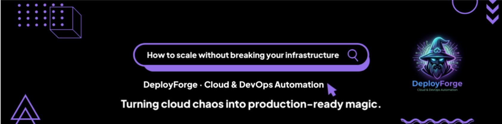

<!-- Profile Banner -->

  

<h1>🧙‍♂️ DevOps Wizard @ DeployForge</h1>

<!-- Right-side CI/CD Flow -->

<!-- Animated typing -->

  

🧙‍♂️ **DevOps Engineer | Cloud & Platform Specialist**

> *I build infrastructure that survives production —  
even under real, heavy traffic.*

---

## 🧠 What I Do

I design, automate, and operate **production-grade cloud infrastructure** with a strong focus on:

- Reliability & scalability  
- Automation-first DevOps practices  
- Secure-by-default systems  
- Clear observability & operational clarity  

I enjoy turning complex systems into **boring, predictable platforms** that teams can trust.

---

## 🏗️ Infrastructure & Platform Engineering

### ☁️ Cloud & Core Infrastructure
AWS · Azure · DigitalOcean  
VPC · VNets · IAM / SSO · Private Networking  
EC2 · VMs · EKS · AKS · Load Balancers  
S3 · Blob Storage · RDS · DynamoDB · Redis  
CloudFront · CDN · Route53 · WAF  

---

### ⚙️ DevOps, CI/CD & Automation
GitHub Actions · Jenkins · Azure DevOps  
Terraform (remote state, modules, multi-env)  
Ansible · GitOps · Helm  
Multi-environment pipelines (dev / staging / prod)  
Automated rollbacks, approvals, and deployments  

---

### 🔐 Security & DevSecOps
IAM & access control design  
Firewall rules · Security Groups · Network isolation  
WAF & CORS management  
SAST / DAST · Snyk · Trivy · SonarQube  
SIEM / SOAR (Azure Sentinel, Wazuh)  
IDS / IPS · Threat detection  

---

### 📊 Monitoring & Observability
Prometheus · Grafana · Loki  
Datadog · Alerting & incident visibility  
Metrics · Logs · Traces that explain failures  

---

### 🤖 AI / ML & MLOps
Kubernetes-based ML platforms  
MLflow for model tracking  
Shared NFS / Azure Files model storage  
Inference APIs with multi-stage Docker builds  
Automated MLOps pipelines  

---

### ⛓️ Blockchain Infrastructure
Private blockchain networks on Kubernetes  
Ethereum (Geth) · Solidity  
PoA-based networks  
Auto-scaling blockchain nodes (Docker + K8s)  

---

## ⚡ Problems I Like Solving
- Fragile CI/CD pipelines  
- Manual cloud setups that don’t scale  
- Security added too late  
- Kubernetes without operational clarity  
- High cloud costs with low visibility  
- Monitoring that shows graphs but no answers  

---

## 🧙 Infra Philosophy

  

- If it’s manual → automate it  
- If it’s exposed → secure it  
- If it’s scaling → observe it  

---

## 🧩 Current Focus
- Platform engineering & internal developer platforms  
- Secure cloud foundations  
- CI/CD reliability & DevSecOps  
- Observability-driven operations  
- AI & Web3 infrastructure at production scale  

---

⭐ *I enjoy building systems that engineers trust and operators sleep on.*
