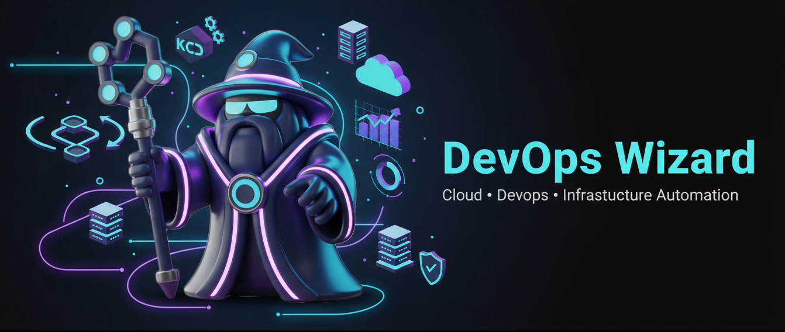

<!-- Profile Banner -->

  

<h1>🧙‍♂️ DevOps Wizard @ InfraForge</h1>

<!-- Right-side CI/CD Flow -->

<!-- Animated typing -->

  

🧙‍♂️ **DevOps Wizard | Cloud & DevOps Freelancer**

> *I build infrastructure that survives production —  
even under real, heavy traffic.*

---

<!-- Neon divider -->

## 🚀 Freelance DevOps Services

I help **startups, SaaS teams, and founders** build, fix, and scale **production-ready cloud infrastructure**.

### 💼 What Clients Hire Me For
- Cloud infrastructure setup & automation (AWS, Azure, DigitalOcean)
- CI/CD pipelines that don’t break on Fridays
- Kubernetes & container platform engineering
- DevSecOps (security baked into pipelines)
- Cloud cost optimization & cleanup
- Monitoring & observability that actually reduces incidents
- AI / ML infrastructure & MLOps pipelines
- Private blockchain & Web3 infrastructure

---

## 🧠 How I Work
- **Production-first mindset** (no toy setups)
- **Automation over manual fixes**
- **Security by default**, not later
- Clean documentation & proper handover
- Infra your team can actually maintain

---

## 🛠️ What I Actually Build

### ☁️ Cloud & Infrastructure
AWS · Azure · DigitalOcean · VPC · IAM · S3 · RDS · DynamoDB · EKS · AKS  
Load Balancers · CDN · WAF · Route53 · Private Networking  

### ⚙️ DevOps & Platform Engineering
Docker · Kubernetes · Helm · GitHub Actions · Jenkins · Azure DevOps  
Terraform · Ansible · GitOps  

### 🔐 Security & DevSecOps
IAM · Network Security · WAF · IDS / IPS  
Vault · Snyk · Trivy · SonarQube · SIEM / SOAR  

### 📊 Monitoring & Observability
Prometheus · Grafana · Loki · Datadog · Alerting  

### 🤖 AI / ML & MLOps
MLflow · Kubernetes Inference  
FastAPI · Model Pipelines · GPU-ready infra  

### ⛓️ Blockchain Infrastructure
Ethereum (Geth) · Solidity · Kubernetes-based private networks  

---

## ⚡ Common Problems I Fix
- Deployments are slow, fragile, or risky  
- Infra isn’t automated or reproducible  
- Cloud bills are out of control  
- Security audits are painful  
- Kubernetes exists but nobody understands it  
- Monitoring shows graphs but gives no answers  

---

## 🧙 My Infra Philosophy

  

---

## ⭐ Let’s Work Together

If you need:
- Short-term DevOps help  
- Infrastructure rescue  
- CI/CD modernization  
- Cloud or Kubernetes setup  
- Ongoing DevOps support  

📩 **Open to freelance & contract work**  
Let’s build infrastructure that doesn’t wake you up at 3 AM.
