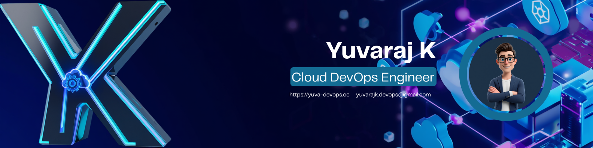

<p align="center">
  
</p>

<h1 align="center">YUVARAJ K</h1>

<p align="center">
  <a href="https://linkedin.com/in/yuvaraj-k-6921b824b">
    
  </a>
  <a href="https://yuva-devops.cc">
    
  </a>
  <a href="mailto:yuvarajk.devops@gmail.com">
    
  </a>
</p>


<p align="left">
  <a href="https://git.io/typing-svg">
    
  </a>
</p>

**Cloud & Infrastructure Engineer · DevOps · Platform Engineering**

> *I architect and operate infrastructure that holds up in production —*  
> *not just on demo day.*

---

## What I Do

I design, automate, and operate **production-grade cloud infrastructure** across AWS, GCP, Azure, and DigitalOcean — with a strong focus on:

- Infrastructure as Code with Terraform and Ansible
- CI/CD pipelines that ship reliably across dev, staging, and production
- Security built in from the start, not bolted on after
- Observability that explains failures, not just shows graphs

I turn complex, fragile systems into **boring, predictable platforms** that engineering teams can trust and operators can sleep on.

---

## Infrastructure & Platform Engineering

### ☁️ Cloud & Core Infrastructure
```
AWS · GCP · Azure · DigitalOcean · Oracle Cloud (OCI)
VPC · VNets · IAM / SSO · Private Networking
EC2 · VMs · EKS · AKS · Cloud Run · Load Balancers
S3 · Blob Storage · EFS · RDS · Redis
CloudFront · Cloud CDN · Route53 · Cloudflare · WAF
```

### ⚙️ IaC, CI/CD & Automation
```
Terraform — remote state, reusable modules, multi-env
Ansible — configuration management, provisioning playbooks
GitHub Actions · Jenkins · Azure DevOps · GitLab CI · ArgoCD
Helm · GitOps · Multi-environment pipelines (dev / staging / prod)
Automated rollbacks, approvals, and zero-downtime deployments
```

### 🔐 Security & DevSecOps
```
IAM & access control design · Secrets management (Vault)
Firewall rules · Security Groups · Network isolation
WAF & CORS management · Cloudflare protection
Trivy · Snyk · SonarQube · SAST / DAST scanning
SIEM / SOAR · Threat detection · IDS / IPS
```

### 📊 Observability & Reliability
```
Prometheus · Grafana · Loki · OpenTelemetry
Alerting & incident visibility · SLI / SLO / SLA design
Metrics · Logs · Traces — the full observability stack
```

### 🤖 MLOps & AI Infrastructure
```
Kubernetes-based ML inference platforms
MLflow · Model tracking and versioning
Shared NFS / Azure Files for model storage
Multi-stage Docker builds for inference APIs
Automated MLOps pipelines on Azure and GCP
```

### ⛓️ Blockchain Infrastructure
```
Private blockchain networks on Kubernetes
Ethereum (Geth) · Solidity · PoA consensus
Auto-scaling blockchain node clusters (Docker + K8s)
Monitoring blockchain node health with Prometheus + Grafana
```

---

## Problems I Like Solving

```
✦ Fragile CI/CD pipelines that block releases
✦ Manual cloud setups that don't survive scale
✦ Security added too late in the delivery cycle
✦ Kubernetes without operational clarity
✦ High cloud costs with no visibility into why
✦ Monitoring that shows graphs but explains nothing
```

---

## Engineering Philosophy

<p>
  
</p>

```
If it's manual      →  automate it
If it's exposed     →  secure it
If it's critical    →  observe it
If it's growing     →  plan for scale before it hurts
```

---

## Current Focus

- Platform engineering & internal developer platforms (IDPs)
- Secure-by-default cloud foundations
- CI/CD reliability and DevSecOps pipelines
- Observability-driven operations
- AI and Web3 infrastructure at production scale

---

## Open To

- Full-time DevOps / Platform / Cloud Infrastructure roles
- Freelance infrastructure projects and consulting
- Collaboration on open-source DevOps tooling

📬 **yuvarajk.devops@gmail.com** · 🌐 **yuvarajk.vercel.app**

---

*Building infrastructure that engineers trust and operators sleep on.*
